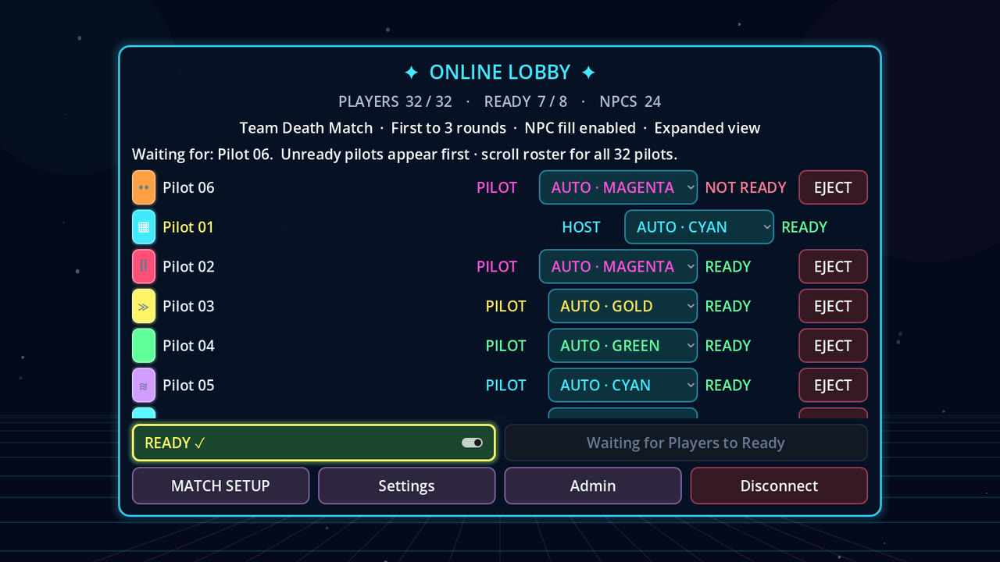
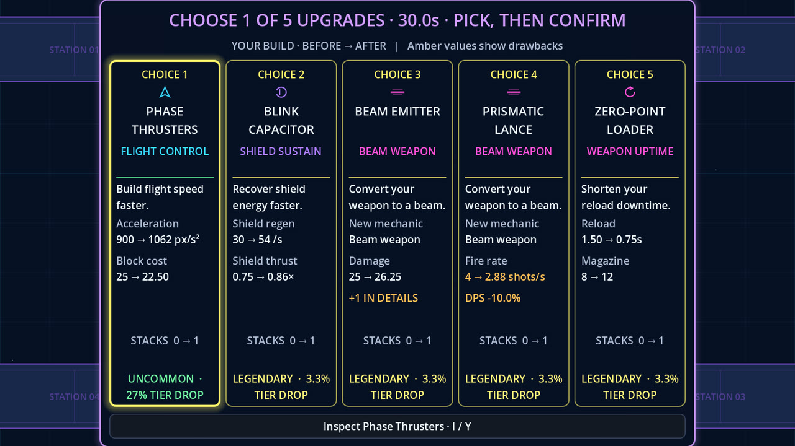
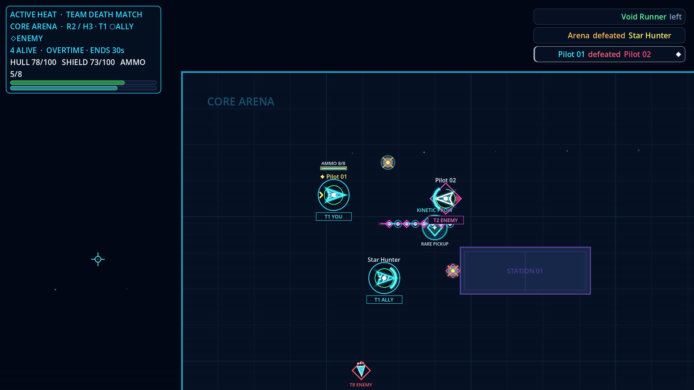
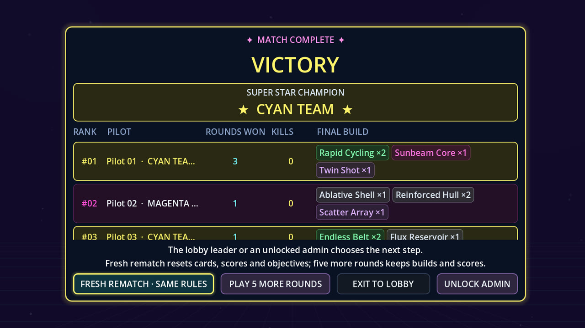

# Super Star Fighter

Super Star Fighter is a top-down multiplayer arena shooter for up to 32 pilots. Every round you draft a new upgrade card, the cards stack without limit, and a sensible little starter ship slowly becomes a screen-filling mechanical disaster. Then you take it into the arena against your friends.

**[Download the latest release](https://github.com/DumpsterFireLabs/SuperStarFighter/releases/latest)** for Windows, Linux (x64 and ARM64), or macOS, plus dedicated servers.

Play solo or in teams across Death Match, Team Death Match, King of the Hill, and Capture the Flag, with any mix of humans and NPCs over LAN, direct connect, or a dedicated server. Each round is a series of short heats. Win two heats to take the round, then pick your next card from a private five-card draw. The first pilot or team to reach the round target wins the match.

Built with Godot 4.7.2 and GDScript. The server runs the simulation, so every player sees the same fight.

## The Loop

| | |
| :---: | :---: |
|  |  |
| **Fill the lobby** with up to 32 humans and NPCs over LAN, direct connect, or a dedicated server | **Draft a card** each round and watch your build compound |
|  |  |
| **Fight heats** with shields, abilities, mines and missiles | **Crown a champion**, then rematch or play five more rounds |

## Highlights

- **136 stackable cards** across seven rarity tiers: faster fire, ricochets, piercing rounds, pulse beams, shield rams, Afterburner, Cloak!, Star Mines, Hunter Missiles, Rebound Shields, and many more.
- **Five modes:** Death Match, Team Death Match, King of the Hill, Capture the Flag, and Team Capture the Flag. Team games support two to eight teams, with friendly-fire protection.
- **2 to 32 pilots**, with any mix of humans and NPCs. NPC difficulty can be set per pilot or for all of them at once, and NPCs play the objectives.
- **Ten arenas** in a shuffled rotation that changes each round, plus optional arena powerups.
- **Easy hosting:** host from the menu in one click, find games on your LAN, join by IP address, or run a dedicated server on Windows or Linux.
- **Relative or Newtonian flight**, keyboard/mouse or controller/joystick, with every action rebindable.
- **An offline build lab** for trying any combination of cards against configurable targets, plus a guided combat tutorial.
- **Custom ship colours and hull patterns**, spectating, live standings, rematches, and a host-controlled pause for everyone.
- **Accessibility options:** HUD scaling, reduced shake and flashes, and an ultrawide HUD safe area.

## Quick Start

The repository includes a pinned, self-contained Godot setup. From PowerShell in the repository root:

```powershell
.\tools\bootstrap.ps1
.\tools\start-client.ps1
```

`bootstrap.ps1` downloads Godot 4.7.2 and its Windows export templates into the ignored `.tools` directory, verifies the official SHA-512 checksums and executable signature, and installs nothing system-wide.

In the game:

1. Press any keyboard, mouse, or controller input on the splash screen.
2. Open **Host Game**.
3. Choose a server name, gameplay TCP port, and required lobby password, then select **Host & Join**.
4. Open **Match Setup** in the lobby. **Match** contains presets, game mode, teams, and rounds to win; **Pilots** contains the player limit and NPC settings; **Arena Rules** contains overtime, powerups, and competitive view. Changes apply immediately. Click your appearance swatch beside your roster name to combine a custom colour with Solid, Zebra, Leopard, Checkerboard, Racing Stripe, or Chevron hull graphics, then apply the appearance or choose a random colour.
5. Every human selects **Ready for Launch**.
6. The lobby leader selects **Start Match**.

Other players on the same subnet can join from **LAN Servers**. **Direct Connect** accepts a hostname or IP address and gameplay port, or a `wss://` address for a server behind Cloudflare, plus the lobby password. Guests may remember an accepted password locally for that exact host-and-port endpoint.

## Controls

Keyboard and mouse is the default profile. Open **Settings → Controls** to switch profiles, select Newtonian ship-facing or Relative screen-aligned flight, remap every gameplay/menu action, tune controller deadzone, or restore only the selected profile's defaults.

If you own several active-ability cards, such as Afterburner, Cloak!, and Star Mines, cycle between them with **Q/E** or **D-pad left/right**, then trigger the selected one with **Shift** or **Left Stick Click**. Passive cards work on their own. **Settings → Accessibility** adjusts HUD scale, shake, flashes, and the centered HUD safe area.

Choose **Learn to play** on the main menu for a short interactive lesson covering movement, firing, reloads, directional shields, Perfect Guard, abilities, and drafting. Each step advances when you perform its action; retry or skip at any time.

Display settings support persistent Windowed, Borderless Fullscreen, and Exclusive Fullscreen modes. Sixteen selectable resolutions cover common 16:9, 16:10, 3:2, 21:9, and 32:9 displays through 5120×2160, including 2880×1920 and 5120×1440 super-ultrawide.

Relative is the default flight mode: movement stays aligned to the screen, so `W` or stick-up always moves upward regardless of aim. Newtonian mode instead follows the ship's heading, so if the ship faces down, `W` moves it down. The local ship carries its own ammo/reload readout above the model.

### Keyboard and mouse

| Input | Action |
| --- | --- |
| `W` / `S` | Fly up / down (Relative) or forward / backward along the ship's nose (Newtonian) |
| `A` / `D` | Fly left / right (Relative) or strafe relative to the ship's nose (Newtonian) |
| Mouse | Aim ship and weapon |
| Left mouse | Fire automatically while held |
| Right mouse | Hold the directional shield |
| `R` | Manually reload a partially used magazine |
| `Q` / `E` | Select the previous / next owned active ability |
| `Shift` | Activate the selected ability |
| `1`–`5` or click, then confirm | Choose and lock in a draft card |
| Hold `Tab` | Show live standings and public builds |
| `Escape` | Open the pilot menu (online combat keeps running) |
| `F2` | Return to the main menu (active sessions ask for confirmation); in the offline lab, switch between the build editor and the firing range |
| `F3` | Toggle network diagnostics |
| `F10` (host only) | Pause or resume the match for everyone |
| `A` / `D` or mouse buttons while spectating | Cycle living pilots |

### Controller / joystick defaults

| Input | Action |
| --- | --- |
| Left stick | Move (screen-aligned in Relative, ship-aligned in Newtonian) |
| Right stick | Aim ship and weapon |
| Right / left trigger | Fire / shield |
| X / Square | Manually reload a partially used magazine |
| D-pad left / right during combat | Select the previous / next owned active ability |
| Left Stick Click | Activate the selected ability |
| View / Back | Hold live scoreboard |
| Menu / Start | Open the pilot menu (online combat keeps running) |
| Left / right bumper while spectating | Cycle living pilots |
| D-pad in menus | Navigate menus and draft cards |
| A / Cross | Confirm |
| B / Circle | Back |

Mapped Xbox-, PlayStation-, and similar controllers use these defaults. Flight sticks and other joysticks can bind any detected axis direction or button from the Controls tab.

## Beta Builds

The main menu shows the current beta and its version, which come from [`release.json`](./release.json). Build and verify the friend-ready Windows x64 client first:

```powershell
.\tools\build-beta.ps1
```

Then cross-build the Linux x64 client:

```powershell
.\tools\build-linux-beta.ps1 -SkipFoundationGate
```

Build the Linux ARM64 client for 64-bit Raspberry Pi and other AArch64 systems:

```powershell
.\tools\build-linux-beta.ps1 -Architecture arm64 -SkipFoundationGate
```

Finally, cross-build the universal macOS client for Apple Silicon and Intel Macs:

```powershell
.\tools\build-macos-beta.ps1 -SkipFoundationGate
```

The Windows script runs the complete foundation gate, exports a single embedded-PCK executable, launches it through its normal rendered startup path, verifies the packaged music inventory, and creates the versioned friend ZIP. The Linux script validates its embedded-PCK ELF architecture and packaged identity for either x64 or ARM64. The macOS script validates the `.app` layout, metadata, embedded identity, and both `arm64` and `x86_64` Mach-O slices. Omit `-SkipFoundationGate` when building any cross-platform package independently. Every tester-facing rebuild must increment the displayed game/build version before export so packages remain distinguishable. Generated builds remain ignored by Git.

The macOS beta is not yet signed or notarized. If Gatekeeper reports that `Super Star Fighter.app` is damaged even after using Control-click → Open, verify the supplied ZIP SHA-256, open Terminal in the extracted folder, run `xattr -cr "Super Star Fighter.app"`, and then use Control-click → Open again. A signed and notarized release will not require this workaround.

### Building without PowerShell

`tools/build.py` performs the same bootstrap, project gate, exports, and package checks with only Python 3.11+ (standard library), on Windows, Linux x64/ARM64, or macOS. Every host cross-builds all seven packages:

```bash
python3 tools/build.py bootstrap   # Godot 4.7.2 + export templates for this OS, SHA-512 verified, into .tools/
python3 tools/build.py build       # project gate, then every client and dedicated-server package
```

Pick targets to build only some packages. Targets: `windows`, `linux-x64`, `linux-arm64`, `macos`, `server-windows`, `server-linux-x64`, `server-linux-arm64`. Groups: `clients`, `servers`, and `all` (the default).

```bash
python3 tools/build.py build clients                    # all four clients
python3 tools/build.py build linux-arm64 server-linux-arm64 --skip-gate
python3 tools/build.py verify                           # project gate only
```

Packages, per-package audits, and a combined `SHA256SUMS.txt` are written to the release directory under `builds/`, or to `--output DIR`. Launch smoke tests run only for binaries the host can execute (Linux clients also need a display); other targets still receive their static header, version, archive, and resource-audit checks. On Windows, use `python` instead of `python3`.

### Linux graphics fallbacks

Linux normally uses the project's Compatibility renderer through desktop OpenGL 3.3. Replace `NN` with the beta number in your file name. On Mesa systems that expose native OpenGL ES 3.0 but not desktop OpenGL 3.3, try:

```bash
./SuperStarFighter-BetaNN.arm64 --rendering-method gl_compatibility --rendering-driver opengl3_es --verbose
```

On a Raspberry Pi or other ARM64 machine with a working Vulkan driver, the Mobile renderer is another possible fallback:

```bash
./SuperStarFighter-BetaNN.arm64 --rendering-method mobile --rendering-driver vulkan --verbose
```

As a slow last resort with Mesa software rendering:

```bash
LIBGL_ALWAYS_SOFTWARE=1 ./SuperStarFighter-BetaNN.arm64 --rendering-method gl_compatibility --rendering-driver opengl3 --verbose
```

Use the `.x86_64` filename for Linux x64. These overrides are compatibility suggestions rather than native acceptance-tested configurations. Godot 4 requires at least OpenGL ES 3.0 for Compatibility; GLES 2-only systems are unsupported. Keep `--verbose` during diagnosis to confirm the selected API, renderer, and GPU.

## Documentation

- [Player and Host Manual](./docs/MANUAL.md) — complete instructions, match rules, card strategy, hosting, settings, and troubleshooting.
- [Development Guide](./docs/DEVELOPMENT.md) — repository architecture, setup, content authoring, testing, and contribution workflow.
- [Documentation Index](./docs/README.md) — the best document for each audience and task.
- [Authoritative Specification](./docs/design/spec.md) — exact gameplay, networking, balance, and acceptance contract.
- [Product Plan](./docs/design/plan.md) — product intent and scope.
- [Ten-Map Roster and Expansion Plan](./docs/design/maps.md) — implemented static layouts and round rotation plus the advanced-mechanics roadmap.
- [Implementation Milestones](./docs/design/milestones.md) — delivered work and verification evidence.
- [Audio Drop-in Contract](./assets/audio/README.md) — accepted music and sound-effect filenames.

## Dedicated Server

[Releases](https://github.com/DumpsterFireLabs/SuperStarFighter/releases) include standalone dedicated-server packages for Windows x64, Linux x64, and Linux ARM64 alongside the client ZIPs; each includes its own launcher and [operations guide](docs/SERVER_README.txt). You can also run a server from a source checkout with its bootstrapped tools.

Start a headless authoritative server with:

```powershell
.\tools\start-server.ps1 -Port 7000 -ServerName "Friday Fight Night" -AdminPort 7001 -MaxPlayers 32 -RoundsToWin 3
```

The launcher prompts securely for the lobby password and, when administration is enabled, a distinct admin password of at least 12 characters. A dedicated server never remembers or writes either password. For unattended service startup, `-PasswordFile` and `-AdminPasswordFile` are read-only startup sources supplied by the operator; keep them ACL-protected and outside the repository. An admin password enables in-game administration through the existing gameplay connection, even with `-AdminPort 0`. The optional TCP command listener binds only to `127.0.0.1`; use an SSH tunnel for remote command-line access. Failed admin authentication and gameplay connection churn are throttled across reconnects, requests and responses are size-bounded, and the bounded address-block file is replaced atomically.

An unattended launch can provide protected one-line password files and a persistent ban file:

```powershell
.\tools\start-server.ps1 -Port 7000 -ServerName "Friday Fight Night" -AdminPort 7001 -MaxPlayers 32 -RoundsToWin 3 -PasswordFile "C:\ServerSecrets\ssf-lobby.txt" -AdminPasswordFile "C:\ServerSecrets\ssf-admin.txt" -BanFile "C:\ServerData\ssf-bans.json"
```

For in-game administration alone, omit `-AdminPort` and keep `-AdminPasswordFile`. The server then opens only its gameplay TCP port.

Common management commands are:

```powershell
.\tools\admin.ps1 -Port 7001 -Command status
.\tools\admin.ps1 -Port 7001 -Command players
.\tools\admin.ps1 -Port 7001 -Command kick -PeerId 4
.\tools\admin.ps1 -Port 7001 -Command ban -PeerId 7
.\tools\admin.ps1 -Port 7001 -Command unblock -Source 203.0.113.8
.\tools\admin.ps1 -Port 7001 -Command set -Setting rounds_to_win -Value 5
.\tools\admin.ps1 -Port 7001 -Command set-password
.\tools\admin.ps1 -Port 7001 -Command restart-match
.\tools\admin.ps1 -Port 7001 -Command shutdown
```

For remote command-line administration, forward a local port through SSH—`ssh -N -L 7001:127.0.0.1:7001 operator@example-server`—then run `admin.ps1` locally against port `7001`. Runtime setting/password changes last only for the current process; persistent values belong in the launch configuration and protected password sources. Address blocks are persisted immediately to the configured ban file. Monitor the JSON-line `simulation_metrics`, especially p95/max latency and `over_budget_ticks`.

Once connected, open **Admin** in the online lobby or **Server Admin** in the pause menu and enter the separate admin password. The panel uses the existing game connection; players need no SSH access or admin port. It shows server status and players and supports moderation, live settings, match restart, and graceful shutdown. Restart begins a fresh match at round one and resets scores and builds. Because gameplay ENet traffic is not encrypted, use a long random admin password; the panel does not offer password rotation over that connection.

The Windows dedicated package includes unattended launch and administration scripts. Health reports continue while idle or paused; admin status includes uptime, recent metrics and their age. See the [dedicated server runbook](./docs/SERVER_README.txt) and [readiness validation](./docs/archive/SERVER-READINESS-2026-09-08.md) for launch commands, capacity gates and measured limits.

Super Star Fighter carries all gameplay over one WebSocket (TCP) connection per player on the selected port, `7000` by default; forward that TCP port for internet play. LAN discovery separately uses UDP `7359` on the local subnet only and is never forwarded. Discovery is local-subnet convenience rather than public matchmaking. Internet hosting requires either forwarding that TCP port or running a Linux dedicated server behind a Cloudflare Tunnel with `--bind=127.0.0.1 --behind-proxy`, which players reach at `wss://your-hostname` on port 443 with no port forwarding ([setup](docs/MANUAL.md#47-hosting-behind-cloudflare-wss-on-port-443)); UPnP traversal is not implemented.

See the [hosting chapter](./docs/MANUAL.md#4-hosting-and-joining) for practical LAN and internet setup.

### Linux dedicated server packages

Build with `tools/build-linux-server.ps1 -Architecture x86_64` or `-Architecture arm64`. Server archives are written under `builds/beta-NN/server-linux-x86_64/` and `builds/beta-NN/server-linux-arm64/`. Each includes a headless shell launcher, Python 3 administration tool, and the [dedicated server operations guide](docs/SERVER_README.txt), including Linux setup and a systemd example. Both tar.gz and ZIP archives are verified for architecture, embedded resources and contents; native Linux launch/load acceptance remains separate.

## Development

Open the project editor:

```powershell
.\tools\run-editor.ps1
```

Run the fast test suite:

```powershell
.\tools\run-tests.ps1
```

Run the complete foundation gate:

```powershell
.\tools\verify-foundation.ps1
```

The test and foundation commands report their actual assertion and check counts. See the [dated review and implementation evidence](./docs/archive/REVIEW-2026-09-03.md) for recorded results and their limits. Network, match-loop, NPC, local-host, presentation, hardening, smoke, export, and 32-client soak harnesses are also included under `tools/`; the [development guide](./docs/DEVELOPMENT.md#11-verification-matrix) explains when to use each one.

## Current Scope

Milestones 0–6 and the subsequent gameplay/presentation improvements are complete. The playable vertical slice includes the full lobby-to-victory-to-rematch loop, five solo/team elimination and objective modes, authored-audio discovery with safe fallbacks, local hosting and LAN discovery, configurable objective-aware NPCs, timed arena card pickups, 136 cards, custom ship colours and hull patterns, and validated 32-client server behavior.

The current beta targets Windows x64, Linux x64, Linux ARM64/Raspberry Pi, and universal macOS, with outputs under `builds/beta-NN/`. Earlier betas remain archived separately. A stripped Windows dedicated-server build is available through `tools/build-server.ps1`, with resource auditing, standalone startup and a short packaged-server 32-client soak verified. Clean-machine testing, native distribution acceptance, longer representative-hardware performance testing, signing/notarization and final release acceptance remain. Public matchmaking, accounts, progression, chat, automatic NAT traversal, and manual map selection/voting are not part of the current slice.

## License and Assets

The source code, scenes, data, tests, tools, and documentation are released under the [MIT License](./LICENSE). The bundled music and the Dumpster Fire Labs logo are **not** covered by it; they remain all rights reserved, and forks should replace them and use a different name. See [asset licensing](./assets/LICENSE.md) for the full breakdown. Any replacement music or sound effects must be original or properly licensed for the project.

The [attribution inventory](./docs/ATTRIBUTION.md) records source/dependency coverage and exact asset hashes, including unresolved provenance. Packages include Godot and bundled-component notices.
