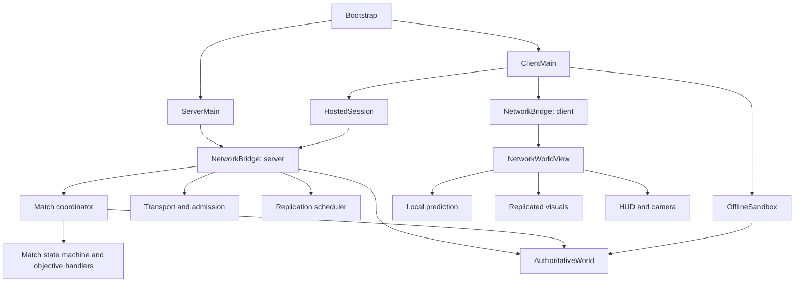

Architectural review — Super Star Fighter — 17 September 2026

Implementation follow-up, 17 September: findings 1–5 below have now been addressed. Reflection updates use the registry's ownership operation; zero is reserved as the tombstone so negative prediction IDs remain valid; build updates refresh the reconstruction cache; projectile and objective reception reject older state across channels; and disconnected spectators are removed without dropping competitor results. Projectile ordering history is bounded and handles chunk interleaving, tick/message wrap, and heat changes. No wire-format change was required. The original findings and reproduction results below describe the pre-fix state.

Follow-up validation: 9,893 assertions passed; real ENet reorder/duplicate and combined latency/loss/reorder profiles passed; local-host admission, discovery, pause/resume, teardown, and reconnect passed. One concurrent local-host run could not bind the shared discovery port while the impairment fixture was using it; the isolated rerun passed. The overload benchmark passed with p95 15.944 ms and max 19.791 ms; the mixed-mine benchmark passed with p95 9.462 ms and max 11.300 ms. These are separate measurements, not evidence of a speed improvement. Findings 6–9 and the smaller maintenance opportunities remain open.

The server-authoritative design is a sound foundation. The main weaknesses are inconsistent ownership inside the client, reuse of a gameplay registry where presentation needs different rules, and avoidable work in the simulation loop. I recommend focused repairs and smaller ownership boundaries, with the existing simulation and networking design retained.

This review assesses the current working tree, including its existing uncommitted changes. It covers startup and hosting, transport and replication, simulation, match and objective coordination, cards and stats, client prediction and presentation, settings, verification, and packaging. The source inventory contains 144 GDScript files and 43 unit-suite files. This is a subsystem review with targeted execution, not a claim that every code path or platform was exercised. Application source was not changed.

The runtime structure is approximately:

Several choices are worth preserving: the lab runs the real authoritative simulation; prediction shares combat stepping and movement rules; map resources become protected runtime data; stat metadata centralizes numeric limits; transport admission and packet codecs are separated from gameplay; and the projectile and spatial indexes already address important scaling costs. There is no evidence here that an ECS rewrite, new networking stack, or wholesale replacement of GDScript would be justified.

The findings below distinguish reproduced failures from architectural observations. “High” means a gameplay correctness repair should precede structural cleanup; it does not mean a crash or server-authority exploit was demonstrated.

1. **High — Reflected projectile updates corrupt the client registry's ownership indexes. Reproduced.**

   [network_replicated_visuals.gd:337](C:/Users/Graphite/Documents/code/SuperStarFighter/src/client/network/network_replicated_visuals.gd:337) assigns `existing.owner_id` directly. [projectile_registry.gd:89](C:/Users/Graphite/Documents/code/SuperStarFighter/src/shared/combat/projectile_registry.gd:89) has a `transfer_owner()` operation specifically because owner counts and ordered queues must change together. The server uses that operation; the client bypasses it.

   After one reflected projectile was removed, the probe found zero live projectiles but an original-owner count of one. After 64 such reflections, a newly added projectile from that owner was immediately evicted from an otherwise empty registry. This can make that pilot's subsequent shots disappear from the client's presentation. Existing reset paths remove projectiles individually rather than reconstructing the registry, so stale owner counts are not reliably repaired by those resets.

   Route ownership changes through the registry and test that owner counts equal actual membership after reflection, removal, and reset. Longer term, separate indexed storage from authoritative budget enforcement. A presentation store should apply server membership and manage speculative visuals without independently deciding authoritative projectile eviction.

2. **High — Powerup build updates do not update the canonical data used to recreate ships. Reproduced.**

   [client_main.gd:971](C:/Users/Graphite/Documents/code/SuperStarFighter/src/client/client_main.gd:971) updates `latest_match_payload` and calls `network_world.apply_builds()`. [network_world_view.gd:420](C:/Users/Graphite/Documents/code/SuperStarFighter/src/client/network/network_world_view.gd:420) updates current visual and prediction stats but leaves its own `match_payload.builds` unchanged. [network_replicated_visuals.gd:630](C:/Users/Graphite/Documents/code/SuperStarFighter/src/client/network/network_replicated_visuals.gd:630) subsequently reads that stale dictionary when reconstructing stats.

   The probe applied Reinforced Hull, increasing displayed ship maximum health from 100 to 125. Rebuilding the ship through the same cached-stat path restored 100. Respawning and reappearing after cloak both use this reconstruction path. The server remains authoritative, but client visuals and locally reconstructed state can disagree with the active build.

   Give client match/build data one owner. Commit a received build revision before updating existing ships, prediction, projectile styling, and standings. Add a powerup → respawn test and a powerup → cloak → reappearance test, covering both permanent and temporary inventories.

3. **High — Replication channels lack a shared policy for rejecting older state. Reproduced for projectiles; objective path confirmed by inspection.**

   Projectile deltas and corrections use separate channels. [network_replicated_visuals.gd:75](C:/Users/Graphite/Documents/code/SuperStarFighter/src/client/network/network_replicated_visuals.gd:75) applies complete corrections and removes every projectile absent from them without comparing their tick or sequence against newer deltas. The packets already carry this information.

   A mine spawned by a delta at tick 200 was removed when the probe subsequently delivered an empty complete correction from tick 190. The reverse ordering can resurrect a removed projectile. Ordered delivery within each channel does not provide an ordering contract across these streams.

   The objective branch at [client_main.gd:961](C:/Users/Graphite/Documents/code/SuperStarFighter/src/client/client_main.gd:961) similarly accepts both reliable transitions and periodic objective updates without a tick watermark. A delayed periodic update can overwrite a newer transition or the objective from a new heat.

   Define a match/heat generation and wrap-aware ordering policy at the client ingress boundary. For projectiles, retain enough per-entity update/removal information that an older complete snapshot cannot delete newer spawns or resurrect later removals. Simply dropping every correction older than the newest delta could starve recovery, so test that case too. Add deliberate cross-channel reorder tests, including heat changes and sequence wrap.

4. **Medium — Predicted projectile IDs conflict with the shared registry's deleted-entry marker. Reproduced.**

   [network_local_prediction.gd:26](C:/Users/Graphite/Documents/code/SuperStarFighter/src/client/network/network_local_prediction.gd:26) starts predicted IDs at `-1` and resets to that value. [projectile_registry.gd:21](C:/Users/Graphite/Documents/code/SuperStarFighter/src/shared/combat/projectile_registry.gd:21) uses `-1` as its tombstone. The projectile renderer and visual stepping loop explicitly skip that value.

   The probe registered the first predicted shot successfully: registry size was one, but `all_projectiles()` returned zero. Its prediction is therefore invisible until an authoritative shot arrives. The registry also treats negative eviction candidates as “none,” another mismatch with its client's ID range.

   Reserve a marker outside every valid ID domain and validate IDs on insertion, or isolate predicted projectiles in a separate store. Merely starting at `-2` fixes the first collision but leaves the negative-ID eviction assumption unresolved. This is the clearest case of reuse imposing the wrong invariants on a second caller.

5. **Medium — Match records grow with spectator churn rather than concurrent player count. Reproduced.**

   [match_state_machine.gd:50](C:/Users/Graphite/Documents/code/SuperStarFighter/src/shared/match/match_state_machine.gd:50) registers a player and score for every late spectator. [match_state_machine.gd:237](C:/Users/Graphite/Documents/code/SuperStarFighter/src/shared/match/match_state_machine.gd:237) removes those records only when disconnecting in the lobby. During a match, even a spectator who never participated remains in both dictionaries.

   With two ongoing participants and 128 sequential spectator visits, the probe retained 130 players and 130 score records. These records enlarge score snapshots and repeated player scans despite the 32-concurrent-player limit. Long matches and match extensions increase the exposure.

   Retain completed participant scores intentionally, but remove disconnected spectators who never entered play. Separate historical results from the live roster, and explicitly bound any retained history. Verify churn with a fixed small number of concurrent peers.

6. **Medium — Disabled silly mode still performs gameplay observations and produces feedback. Confirmed by inspection; savings not benchmarked.**

   [authoritative_world.gd:160](C:/Users/Graphite/Documents/code/SuperStarFighter/src/shared/combat/authoritative_world.gd:160) invokes danger and pursuit observation every sixth tick. The pursuit observer contains nested player loops; both observers can perform line-of-sight queries. Damage, shield, and collision paths also maintain the feature's histories. The world and replication scheduler do not consult `silly_mode`; gating happens in client audio playback.

   Normal matches consequently pay for feature-specific bookkeeping, qualifying reliable feedback, and some pairwise geometry queries even when no announcer audio can play. It also places presentation-specific cue names and policies throughout the authoritative combat implementation.

   Pass a match-level enable flag into a focused combat observer and avoid constructing disabled-feature history or cues. Keep damage attribution and ordinary hit feedback authoritative and always available. Compare the same deterministic match with the feature enabled and disabled before claiming a performance improvement.

7. **Medium — Overtime logging serializes a complete match view every active tick. Measured.**

   [network_bridge.gd:1283](C:/Users/Graphite/Documents/code/SuperStarFighter/src/shared/network/network_bridge.gd:1283) calls `current_state_payload()` before checking whether overtime has started or was already logged. [authoritative_match_coordinator.gd:668](C:/Users/Graphite/Documents/code/SuperStarFighter/src/shared/match/authoritative_match_coordinator.gd:668) reconstructs scores, sorted identities, effective builds, contributions, objective state, and other collections for that call.

   In a local probe with 32 players and 16 card entries each, this logger check alone took about 0.23 ms median; observed p95 values across runs were approximately 0.24–0.36 ms. At 60 calls per second, median cost is roughly 14 ms of CPU time per second for a check needing only a deadline and heat identity. The cost also grows with the historical records described above.

   Emit an overtime-start event once from match coordination, or expose a small observation containing the relevant tick, round, and heat. Keep full snapshot construction for actual synchronization and state transitions. This is a low-complexity optimization with measured benefit, though it is not the largest simulation cost.

8. **Low — Client owner extraction leaves a broad, mutable dependency graph. Architectural observation.**

   [network_world_view.gd:29](C:/Users/Graphite/Documents/code/SuperStarFighter/src/client/network/network_world_view.gd:29) exposes a large set of writable compatibility properties. Each extracted owner also receives the complete view and reaches through it into siblings; for example, [network_local_prediction.gd:14](C:/Users/Graphite/Documents/code/SuperStarFighter/src/client/network/network_local_prediction.gd:14) directly edits the visual registry, while the HUD modifies prediction selection. The split reduces file size but does not enforce responsibility boundaries.

   The duplicate match/build dictionaries in finding 2 are a concrete consequence. `ClientMain` also coordinates UI by calling controller methods marked private and changing their dirty flags directly.

   Introduce a small client match-state owner first. Then pass owners only the observations, commands, and output callbacks they need. Move compatibility helpers into test adapters as callers migrate. Avoid adding another generic service locator or a large interface hierarchy; narrow concrete methods are sufficient.

9. **Low — Embedded and dedicated hosting compose common services differently. Architectural observation.**

   [server_main.gd:15](C:/Users/Graphite/Documents/code/SuperStarFighter/src/server/server_main.gd:15) attaches the background log writer. [hosted_session.gd:25](C:/Users/Graphite/Documents/code/SuperStarFighter/src/client/network/hosted_session.gd:25) constructs a bridge directly, leaving logging on its synchronous fallback. The two paths share authoritative gameplay, but a host playing locally does not receive the dedicated server's protection against slow log sinks.

   Extract a small server-runtime composition helper that assembles the bridge and logging policy for both entry points. Keep optional remote administration and process shutdown at the dedicated entry point, and keep isolated MultiplayerAPI registration with the embedded host. A slow-sink integration check would measure whether the remaining difference affects hosted frame pacing.

Two smaller cleanup opportunities are also supported by the code. Connection, accessibility, and video preferences depend on `AudioDirector.SETTINGS_PATH`, while input profiles separately duplicate the same path. A neutral settings store/path would remove this unrelated dependency and centralize save-error handling. Release identity is repeated across project metadata, shared constants, and several platform build scripts; one release manifest could generate or validate those values. Documentation already illustrates the drift: the development guide lists protocol 35 while current code and tests use 36. These are maintenance improvements, not demonstrated runtime failures.

Validation performed:

| Check | Result and scope |
| --- | --- |
| `tools/run-tests.ps1` | 9,688 assertions passed, zero failed. |
| `tools/verify-local-host.ps1` | Admission, discovery, global pause/resume, teardown, and reconnect passed. |
| `tools/run-performance-benchmark.ps1` | Core arena, 32 NPCs and 1,024 projectiles: p50 13.917 ms, p95 15.152 ms, p99 18.397 ms, max 18.843 ms. Passed its overload budgets. |
| Mixed-mine benchmark | 512 mines and 1,024 total projectiles: p95 8.869 ms, max 9.982 ms. Passed. |
| `tools/update-export-policy.py --check` | Shipping resource allowlists current. |
| `tools/verify-attribution.py` | Inventory check passed; its output still reports 64 assets needing provenance resolution. This was an inventory check, not a resolution of those records. |
| Targeted architecture probes | Reproduced stale build restoration, correction ordering, predicted-ID collision, ownership-index corruption and accumulation, and spectator record growth; measured overtime logging cost. |

The engine emitted the root-certificate-store warning already allowed by the repository's verification wrapper. No other errors were emitted by the focused probes. Probe source and output are available locally as [architecture-review-2026-09-17.gd](C:/Users/Graphite/Documents/code/SuperStarFighter/.tools/architecture-review-2026-09-17.gd) and [architecture-review-2026-09-17.log](C:/Users/Graphite/Documents/code/SuperStarFighter/.tools/architecture-review-2026-09-17.log). These files are under the ignored tools directory.

The performance benchmark explicitly excludes replication, match coordination, and client rendering. Its passing overload threshold therefore does not establish a complete 60 Hz server/client frame budget. In that run, mean projectile processing was 9.38 ms and NPC input generation 2.14 ms. After the inexpensive fixes above, further simulation optimization should start with measured obstacle/ship sweep costs and representative full-server traces. Rendering needs its own graphical measurements. Native Linux/macOS behavior, a new long soak, a complete foundation gate, and new release exports were not run in this review.

Recommended order: repair projectile registry invariants and build ownership; add cross-channel ordering and spectator-lifetime coverage; remove disabled-feature and logging overhead; then narrow client interfaces and unify common hosting composition. Add regression tests for the reproduced scenarios rather than relying on assertion count alone. The current suite is broad, but its passing result does not cover these specific transitions and lifetimes.
