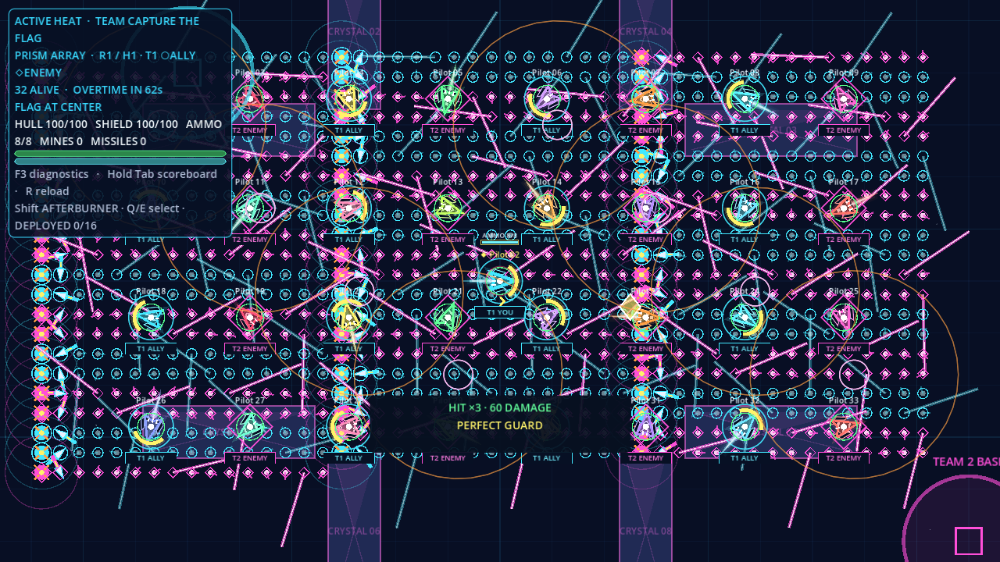
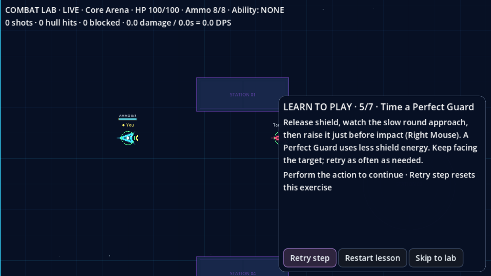
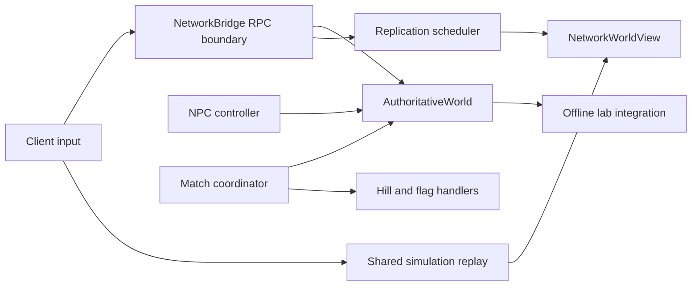
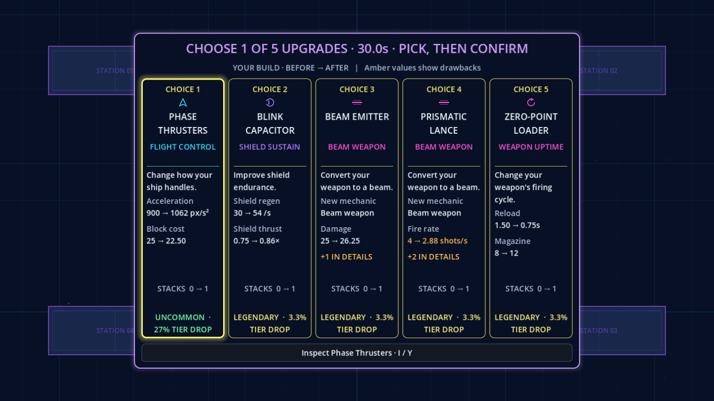

# Super Star Fighter — comprehensive review

**Date:** 4 September 2026  
**Build:** `0.1.0-beta.10`, Godot `4.7.2.stable.official.ed1daf0bf`  
**Baseline:** working tree over `9f47832699768f5413a79f4a39c247360748b1aa`, including staged and unstaged changes present during this review.

This is an independent assessment of the current implementation. Evidence comes from source inspection, fresh automated runs, rendered captures, and new focused reproductions. Production code was not changed.

The working tree was active during the review: missile replication and related tests also changed. Those closing diffs were inspected and the fast suite was rerun, passing **5,894 assertions**. Earlier runs remain evidence of their execution-time state, rather than a claim that every gate was repeated against one frozen checkout. The closing source fingerprint is retained with the evidence; protocol/packet versions at close were 31/13.

## Assessment

Super Star Fighter has a substantial playable foundation: authoritative combat, a complete match loop, shared offline practice, private drafting, several objective modes, and a recognizable visual identity. Shared simulation and bounded projectile/feedback systems are particularly valuable. The implementation deserves focused stabilization and player testing.

**The current evidence does not support a clean release sign-off.** Flag-mode NPCs emit repeated engine errors; countdowns publish incorrect solo flag bases; shield effects can report events that never happened; and the combined network impairment fixture fails. Dense combat and large-lobby pacing also need attention. These are more consequential than adding another mechanic or increasing the card count.

| Area | Assessment |
| --- | --- |
| Code correctness | Broad automated coverage, with important integration gaps below |
| Architecture | Sound simulation boundaries; incomplete separation of owners and compatibility APIs |
| Presentation | Cohesive menus and useful card previews; crowded combat lacks a clear visual priority |
| Gameplay | Interesting offense/defense/build decisions; population scaling and objective pacing need tuning |
| Networking | Basic and individual impairment profiles pass; combined faults remain unresolved |
| Delivery | Resource allowlists and attribution inventory pass; fresh package/platform acceptance was outside this run |

## Scope and evidence limits

The source inventory contains **131 GDScript files / approximately 28,600 lines under `src`**, including harnesses, plus **35 unit-suite scripts**, 136 card resources, and ten map resources. Inspection concentrated on authority, match transitions, input/replay, replication, objective/NPC interactions, stat derivation, drafting, UI ownership, drawing, audio, and build verification. This was not an exhaustive proof of every source line or every card combination.

Fresh presentation generation completed **69 states at each of four resolutions**: 1280×720, 1920×1080, 2880×1920, and 5120×1440. Fourteen selected images were visually inspected, covering menus, lobby, drafting, normal and crowded combat, objectives, tutorial, lab, results, and competitive view. File generation alone is not visual approval of all 276 images. The competitive capture contains the fitted content rather than native window bars.

Gameplay evidence is automated: skilled bots, deterministic fixtures, and production simulation. There was **no manual human play session, controller hardware trial, or audio listening assessment**. Audio observations concern implementation and a headless memory probe. No new exports, clean-machine installs, native Linux/macOS acceptance, internet-router traversal, or extended soak were performed. Timings are from this Windows/NVIDIA RTX 2080 Ti workstation, not minimum-spec acceptance measurements.

## Prioritized findings

### F1 — P1: flag-mode NPCs generate an engine-error flood

**Confirmed by the full gameplay run and a minimal reproduction.** [NPC objective lookup, line 269](../src/shared/combat/npc_pilot_controller.gd#L269) evaluates:

```gdscript
zones.get(zone_id, zones.get(str(zone_id), combatant.position))
```

The fallback argument is evaluated even when `zone_id` exists. The production [objective view](../src/shared/match/objective_state.gd#L52) now exposes `Dictionary[int, Vector2]`, so the inner string lookup emits both a typed-key validation error and a dictionary-get error. The minimal call still returns an intent; this is an error/logging defect, not evidence that every NPC stops moving.

The longer study reached flag-mode pacing and began repeating this stack on NPC updates. It was stopped to avoid continuing the flood. The affected path is also used by server-owned flag-mode NPCs, including the advertised team-objective preset. Repeated errors add logging and processing overhead and obscure other failures.

**Remedy:** use integer keys for internal objective views; normalize serialized keys once at a transport boundary. If both forms genuinely need support, branch on dictionary typing or key presence before evaluating the fallback. Exercise both flag modes through `coordinator.npc_objective_state()` and real NPC input submission, with an assertion that no unexpected engine errors occur. Do not rely solely on hand-built untyped test dictionaries.

### F2 — P2: countdowns announce flag bases before assigning the new spawns

**Confirmed through a normal draft-to-countdown transition.** [_capture_transitions](../src/shared/match/authoritative_match_coordinator.gd#L285) resets the objective and queues `STATE_CHANGED` before `_handle_state_entry()` prepares the world. Solo CTF capture zones are updated from actual launch positions only in [_prepare_world_heat](../src/shared/match/authoritative_match_coordinator.gd#L375).

With seed 12345, the countdown event announced both pilots' bases at `(1600, 170)`. Immediately afterward, the authoritative bases were `(180, 817.1429)` and `(3020, 1480)`. Subsequent active-state publication corrects this, but the three-second planning period shows incorrect navigation information; later heats can expose previous spawn assignments.

**Remedy:** complete spawn assignment and objective configuration before serializing the countdown event. Add a contract test comparing the emitted countdown zones with the prepared world's launch positions, including the next heat and a map change. Preserve intentional ordering for other state transitions rather than blindly moving every side effect.

### F3 — P2: shield feedback can announce nonexistent blocks and breaks

**Confirmed with the production presentation helper.** [Snapshot feedback, lines 341–350](../src/client/network/network_replicated_visuals.gd#L341) treats a shield-energy drop over two as a block, and crossing the regeneration unlock threshold as a break.

The reproduction produces `shield_break` for an active shield dropping from 26 to 24 energy, then `shield_block` for a drop from 24 to 20 with no impact. [ShieldState](../src/shared/combat/shield_state.gd) depletes at zero; its threshold governs unlocking after depletion. Continuous drain, longer gaps between snapshots, and high-drain builds can cause false block effects. Small actual blocks can also fall below the heuristic threshold.

These cues teach the player incorrect defensive timing and can add unnecessary audio/visual noise. Remote shield thresholds also use the base constant rather than each build's effective threshold.

**Remedy:** drive block confirmation from authoritative impact events/counters and break feedback from an explicit depletion transition. Reuse the existing combat-feedback path where possible. Test continuous drain, packet gaps, reduced-cost Perfect Guard, actual depletion, and upgraded remote shields separately.

### F4 — P2: some verification wrappers miss engine errors

[run-tests.ps1](../tools/run-tests.ps1) rejects `SCRIPT ERROR:` and missing/failed summaries, but does not reject generic `ERROR:`. [measure-gameplay.ps1](../tools/measure-gameplay.ps1) similarly checks script errors and a completion marker. F1 demonstrates that an engine error can occur while execution continues and a function returns a value.

The fresh fast suite reported **5,863 passed / 0 failed**. Its observed engine errors concerned the restricted environment's default log path and certificate store, not F1. Thus this is a weakness in the acceptance rule, not a claim that the fast suite itself reproduced flag-mode errors.

**Remedy:** centralize exit-code, completion-marker, `SCRIPT ERROR:` and `ERROR:` validation. Use narrow, explicit allowances for known environment diagnostics. Give concurrent processes unique absolute engine-log paths. The foundation wrapper already provides a useful pattern. Ensure a deliberate engine-error fixture makes the gate fail even when the test summary says zero failures.

### F5 — P2: combined network-fault acceptance remains unresolved

Baseline, latency/jitter, loss, reordering/duplication, and blackout profiles passed in the fresh run. **Combined faults failed twice.** The first failure was `missing combat coverage` with only two authoritative shots. The retry failed final convergence despite matching reported ammunition, shot counts, reload state, ability charges, and special identity.

This is insufficient evidence to label a particular production resource system broken. [_settled](../src/test/network_impairment_verifier.gd) also requires an empty replay buffer and inactive shield/cooldown. The fixture stops producing input, sends its final sample once over an unreliable path, and waits; losing that final sample is a plausible reason an acknowledged-input buffer never empties. That hypothesis needs instrumentation, not assumption.

**Remedy:** log the final buffer length, oldest/newest sequences, server acknowledgment, cooldown, and shield state. Keep sending neutral input until the final sequence is acknowledged, then evaluate settlement. Separate delivery coverage from durable-state convergence. Repeat across seeds and record movement correction/snap tails as well as resource equality. Keep the failed runs visible until their cause is resolved.

### F6 — P2: crowded combat overwhelms threat recognition

**Visual assessment of an intentionally extreme fixture, not a frequency estimate for ordinary matches.** With 32 ships and 1,024 projectiles, repeated ally circles, enemy diamonds, trails, shield rings, names, team labels, and effects fill the scene. The local ship and objective lose visual precedence. [ProjectileLayer](../src/client/presentation/projectile_layer.gd#L150) draws a full team marker per projectile even in simplified mode; friendly attenuation does not apply to that marker.

Reduced flashes and shake do not solve spatial density. At 150% HUD scale, the crowded fixture's upper-left panel occupies roughly a third of screen width and more than half its height, while background combat remains visible through it.

**Remedy:** budget decorative information separately from dangerous projectiles. Reduce friendly marker intensity with the rest of the friendly projectile, simplify distant names/build details, and prioritize the local hull, nearby hostile trajectories, and objectives. Keep hostile hit geometry readable. Test recognition tasks with people rather than accepting a screenshot solely because it renders.



### F7 — P2: the enlarged tutorial obstructs the practice target

In the fresh 720p / 150% HUD capture, the Perfect Guard instruction panel covers the right portion of the target and its surrounding approach area. [Tutorial layout](../src/client/sandbox/combat_tutorial.gd#L209) sizes the panel from HUD dimensions without coordinating placement with the target or projectile lane.

The text and buttons remain readable, but the exercise asks the player to watch incoming fire while its source is obscured. This is an accessibility/usability defect even though the controls fit on screen.

**Remedy:** reserve a visible practice lane, reposition target/camera based on panel bounds, or allow a compact instruction state after reading. Verify the target, approach path, player, and controls simultaneously at supported HUD scales.



## Architecture and code quality

The central design is appropriate for this game:



The diagram describes responsibilities/data relationships, not a literal dependency-free call graph.

**Preserve these strengths:** server-owned scoring and damage; small binary codecs; distinct traffic channels; shared movement/combat replay; bounded projectile registries and correction assembly; spatial collision queries; typed objective events; centralized stat descriptors; resource-authored maps; and offline practice using the same rules as authority. These reduce duplicate logic and make deterministic investigation practical.

**The main maintainability problem is incomplete ownership separation.** `client_main.gd` is 1,817 lines, `connection_controller.gd` 1,470, `network_bridge.gd` 1,421, and `authoritative_world.gd` 1,252. Size alone is not a defect. More concretely, bridge compatibility setters expose session/replication internals, while owners retain a bridge reference and call back through it. View helpers similarly reach through one another's internals. Moving state into helper files has not yet produced narrow contracts.

Use the confirmed typed-dictionary mismatch as a guide: document the type and lifetime of every boundary value. Prefer typed internal APIs and normalize only at transport/UI boundaries. Remove compatibility accessors incrementally once production callers migrate. Avoid a general rewrite; split around stable responsibilities such as connection settings persistence, lobby presentation, simulation stepping, and event publication. Protect the resulting behavior with integration tests rather than assertions that merely inspect ownership fields.

**Map immutability is incomplete.** [MapRegistry.definition](../src/shared/arena/map_registry.gd#L92) returns its cached mutable Resource, and `movement_fields()` returns a read-only array containing mutable field Resources. A fresh probe changed a field multiplier to 1.99 and observed it through the next registry lookup. It restored the value within that isolated process. No existing production caller was observed exploiting this; classify it as a maintenance hazard rather than a demonstrated player-facing bug. Expose immutable runtime values or defensive copies for consumers that can edit authored resources, and test nested mutation rather than only array mutation.

**Security posture fits a controlled beta better than an adversarial service.** RPC role/sender checks, admission limits, input expiry, bounded admin messages, localhost administration, and address throttling are useful. The hardening fixture passed. The password proof in `network_protocol.gd` is a fast SHA-256 of public challenge plus password material; a captured exchange permits offline password guesses. It is not an encrypted session or authenticated server identity. Remembered lobby passwords use a local ConfigFile. Before treating internet hosting as a hardened service, define that threat model and choose established transport/authentication mechanisms. This inspection did not include penetration testing or an exploit claim.

## Presentation and audio

**The visual identity is consistent.** Dark navy surfaces, cyan structure, purple accents, yellow focus/rarity cues, geometric ships, and distinct result treatments make the product recognizable. The menu has understandable entry points, the lobby surfaces unready pilots, and results explain the difference between a fresh rematch and an extension.

**Drafting communicates meaningful changes.** The five-column layout keeps choice count, timing, stack changes, drawbacks, and inspection discoverable. Effective before/after stats are considerably more useful than nominal card percentages. Rarity, role, and mechanic icons help scanning. The inspected 720p and 3:2 captures were readable.



The next improvements should emphasize information hierarchy. A weapon card can display the same broad role as another while its important differences remain in details. Show the principal tactical consequence first; keep drop-rate text secondary to the decision. In the lab, 150% scaling leaves only a few list entries visible and places description content below the fold. This is scrollable, not evidence of missing content, but makes search and inspection more laborious.

Combat HUD text combines phase, map, team, objective, resources, hints, and ability capacity. Separate persistent essentials from transient tutorial hints; use compact resource/ability widgets and stronger local emphasis. Offscreen flag/base markers are useful and have explicit labels, but dense situations need collision/priority management between them.

Map palettes and material patterns provide differentiation without requiring detailed textures. Continue building recognizable landmarks and traversable lane shapes. Judge new environmental mechanics by whether their direction, extent, and effect are clear during motion; a still image cannot validate the feel of Solar Current.

Audio code provides dedicated music/SFX buses, limited voices, priority handling, stereo positioning, ducking, lazy music loading, and cache limits. Fresh startup inventory found one menu track, nine gameplay tracks, and one win track. The headless probe reported about 0.60 MiB additional tracked static allocation and zero music-data bytes; this measures deferred loading in that fixture, not peak live audio memory or mix quality. Loudness, fatigue, loop transitions, and simultaneous-event clarity require listening. F3 should be corrected before judging defensive sound cues.

## Gameplay findings

The strongest gameplay idea is the interaction between movement, directional defense, automatic fire/reload windows, and compounding builds. Independent ability selection avoids consuming every owned ability on one input. Winner draft byes can create catch-up opportunities, and temporary pickups add heat-level variation without necessarily carrying an advantage through the match.

### Population and pacing

A clean follow-up used the existing production study fixture for three modes, 2/8/32 participants, one seed (`7100`), and three heats per case. All nine cases completed. Most heats used Dead Freight; one duel case advanced to Longwave Array. This is a diagnostic sample, not coverage of the ten-map roster.

| Mode | Pilots | Heat durations, seconds | Median first contact, seconds |
| --- | ---: | --- | ---: |
| Death Match | 2 | 77.08 / 12.23 / 29.70 | 16.80 |
| Death Match | 8 | 49.62 / 30.35 / 28.35 | 0.88 |
| Death Match | 32 | 36.40 / 27.52 / 33.55 | 0.13 |
| Team Death Match | 2 | 16.55 / 15.58 / 14.93 | 3.10 |
| Team Death Match | 8 | 15.83 / 16.93 / 25.65 | 2.75 |
| Team Death Match | 32 | 33.37 / 36.27 / 37.83 | 0.88 |
| King of the Hill | 2 | 31.20 / 50.72 / 38.82 | 5.42 |
| King of the Hill | 8 | 105 / 105 / 105 | 1.53 |
| King of the Hill | 32 | 105 / 105 / 105 | 0.13 |

Eight- and 32-pilot hill heats all reached the configured 105-second cap. Sole-occupant scoring is difficult to accumulate when many opponents continually return. Test population-specific hill targets, hill size, respawn timing, or multiple objectives before assuming one ruleset serves every lobby size. The sample cannot distinguish a generally poor mode from this map/seed/NPC interaction.

Eliminated pilots in the elimination-mode sample waited as long as **39.35 seconds in eight-player DM**, **35.50 seconds in 32-player DM**, and **35.37 seconds in 32-player TDM**. Spectating and standings help, but repeated inactivity can undermine a party-oriented game. Test shorter heat pacing or a clearly differentiated respawn preset. Objective-mode elimination totals can include several deaths and must not be interpreted as one continuous wait.

The duel's long initial approach and large-lobby near-instant contact suggest population-aware spawn/map selection deserves investigation. These are bot contact metrics, not measured human reaction opportunities. Flag-mode pacing and pickup fairness remain unassessed because F1 invalidated the full run.

### Builds, balance, and availability

A separate clean three-seed balance run produced 48 paired matchups and 96 controlled comeback bouts. Each matchup below includes two maps and both starting-side assignments; 60-second unfinished bouts are draws.

| Prescribed matchup | Left wins | Right wins | Draws |
| --- | ---: | ---: | ---: |
| Sustain vs burst | 4 | 8 | 0 |
| Shield vs multishot | 0 | 11 | 1 |
| Ram vs mobility | 7 | 4 | 1 |
| Range vs cover | 1 | 11 | 0 |

Multishot beating the selected shield recipe and cover beating the selected range recipe are good counterplay-test candidates. They do not establish overall card dominance: NPC movement and aiming policies, exact three-card recipes, cover geometry, and rare card availability strongly constrain the result.

The target-aware acquisition fixture reinforces that limit. By round eight, with byes on rounds three and six, six of eight exact recipes completed **0/60** times; cover completed **2/60**, ram **1/60**. Players should be able to recognize and pursue useful families without needing these exact recipes. Consider family-level synergy guidance and measure whether actual draft choices generate satisfying partial builds. Do not increase rarity rates solely to make this fixture's recipes common.

Unlimited inventory stacks have bounded effective stats. Another copy supplied no effective benefit for **2/136 cards at one existing stack**, **3/136 at three**, **52/136 at ten**, and **135/136 at one hundred**, in isolated single-card builds. This is expected to some degree from safety clamps and already-owned mechanics, but the product promise should distinguish unlimited stacking from unlimited power. Continue exposing capped effects and assess whether manual offers remain interesting late in extended matches. Clamp removal would increase technical risk and is not recommended by this review.

Comeback experiments were mixed. For example, the burst leader won 5/6 with the prescribed permanent pickup versus 3/6 with equal builds, while mobility stayed 3/6. Tiny deterministic samples do not establish a catch-up policy. Temporary pickup expiration returned the tested builds to the equal-build results, which supports the implementation contract. Human draft decisions and longer match histories remain necessary.

## Performance and validation

| Fresh check | Result and interpretation |
| --- | --- |
| Fast test suite | Initial 5,863 and closing 5,894 assertions passed, zero failed; environment log/certificate errors noted |
| Hardening | Passed: malformed/excessive peers isolated; healthy clients continued |
| Match loop | Passed: private choices, timeout picks, two matches, reset/rematch, shutdown |
| 32-client soak, 60-second configuration | Passed: all initial clients, 11 metric windows, overtime, combat disconnect, late spectator, bounded entities, clean shutdown |
| Network impairment | Five individual profiles passed; combined failed twice (F5) |
| Standard presentation wrapper | Failed after successful 720p capture due to default-log/certificate errors |
| Direct additional presentation runs | Exit zero and completion markers at 1080p, 3:2, and ultrawide; environment diagnostics remain |
| Gameplay all-sections run | Stopped after repeated flag-mode engine errors; no complete report claimed |
| Clean balance / reduced pacing scope | Completed; raw rows and limitations retained |
| Core Arena overload benchmark | Passed its configured overload thresholds; figures below |
| Audio memory probe | Completed one headless sample; no listening or recording acceptance |
| Attribution / export policy | 14 inventoried assets, zero unresolved provenance entries; resource allowlists current |

The overload benchmark maintained 32 NPCs and 1,024 projectiles over 120 measured ticks after 20 warmup ticks. **p50 13.82 ms, p95 17.19 ms, p99 21.38 ms, maximum 23.24 ms.** The mixed-mine fixture measured p95 9.68 ms and maximum 11.50 ms. Projectile work dominated the ordinary fixture.

Passing the overload gate does not prove steady 60 Hz: its p95 budget is 20 ms, and this run's p95 exceeds the 16.67 ms tick interval. It excludes replication, client rendering, and fixture refill. Dense draw-submission p95 ranged from 18.52–20.41 ms across the four capture sizes, measured separately while other review jobs were active. Neither measurement is a complete frame time, and they must not be added together or treated as FPS measurements. Profile representative live builds, target hardware, packet serialization, and rendering together before setting minimum specifications.

The short 32-client loopback soak reported a maximum window p95 of 6.37 ms. This supports basic live-load behavior and lifecycle cleanup for the exercised scenario; it does not cover sustained adverse internet conditions or the flag-mode defect. Its length is insufficient for a memory-stability or long-session claim.

The release gates should also cover flag-mode NPCs, transition payload equality, authoritative feedback semantics, map-field prediction, and multiple network-fault seeds. Asset inventory verification records metadata consistency; it is not independent legal clearance. The repository still requires a project licensing decision.

## Recommended order of work

1. **Stabilize authority and evidence:** fix F1; make wrappers detect unexpected engine errors; reproduce both flag modes with NPCs over multiple heats. Diagnose F5 without weakening its acceptance criteria.
2. **Correct player information:** fix countdown base publication and authoritative shield feedback. Add behavioral regression cases for their exact triggers.
3. **Make combat readable:** simplify friendly/decorative layers, reduce HUD obstruction, and keep the tutorial firing lane clear at enlarged scales.
4. **Run structured playtests:** compare duel, small skirmish, team objectives, and 32-pilot chaos separately. Measure time to first meaningful encounter, eliminated wait, hill completion vs timeout, draft decision time, and threat/objective recognition.
5. **Finish ownership boundaries incrementally:** normalize transport dictionaries once, migrate compatibility callers, protect cached resources, and isolate persistence/UI responsibilities.
6. **Complete release acceptance:** repeat sustained combined-network and live-load tests; export fresh packages; test clean Windows installs and native cross-platform builds; audition audio on actual output devices.

## Reproducibility

Commands used included `tools/run-tests.ps1`, `tools/verify-hardening.ps1`, `tools/verify-match-loop.ps1`, `tools/verify-presentation.ps1`, `tools/verify-network-impairment.py`, `tools/run-performance-benchmark.ps1`, `tools/verify-audio.ps1 -Samples 1 -SkipRecording`, and the attribution/export-policy checks. Gameplay balance used `tools/measure-gameplay.ps1 -Section balance -Seeds 3` with a fresh output path. Direct capture invocations used `src/test/presentation_capture.gd`, explicit resolutions, hidden windows, and fresh output directories.

Durable evidence is in [review-evidence-2026-09-04](review-evidence-2026-09-04/): [minimal probes](review-evidence-2026-09-04/reproduce.gd), [probe output](review-evidence-2026-09-04/probes.txt), [balance rows](review-evidence-2026-09-04/balance.json), [pacing rows](review-evidence-2026-09-04/pacing.json), [pacing driver](review-evidence-2026-09-04/pacing.gd), [performance output](review-evidence-2026-09-04/performance.txt), [first network run](review-evidence-2026-09-04/network-first-run.txt), and [combined retry](review-evidence-2026-09-04/network-combined-retry.txt). Probe scripts deliberately exercise defects and may emit engine errors. Run them from the repository with the pinned Godot executable; they do not alter production source. The pacing driver writes its generated result under `reports/fresh-review-2026-09-04/`, which must exist.

The [closing source SHA-256 manifest](review-evidence-2026-09-04/source-sha256.json), [closing test summary](review-evidence-2026-09-04/validation.txt), and [32-client soak summary](review-evidence-2026-09-04/soak.json) also accompany the report. The soak command was `tools/verify-soak.ps1 -ClientCount 32 -DurationSeconds 60`.

Additional generated logs/captures remain under ignored `.tools` and `reports/fresh-review-2026-09-04`. Selected captures are retained beside the report so its principal visual findings remain reviewable.
