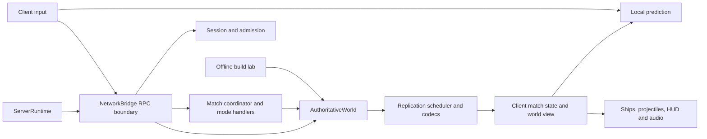

**Super Star Fighter — performance, architecture, and playability review — 22 September 2026**

The authoritative simulation is a good foundation for this game. Keep it, the shared offline lab, and the existing prediction model. The immediate priorities are dense drawing-command cost, first-use audio stalls, replication correctness gaps, and a broken release preflight. Small-group play has a credible technical foundation; consistent 32-player performance and semi-competitive fairness are not yet established by the available evidence.

This review covers the current working tree at base commit `c217272d6e48ae88436ea1be5b5337d6f73ee169`, including pre-existing staged and unstaged changes. It examines startup/hosting, simulation and collisions, NPCs, match/objective coordination, cards/drafting, transport and recovery, prediction, presentation/audio, operations, tests, and packaging. Application code and balance values were not changed. The deliverables are this review, executable diagnostic probes, and retained measurements with source hashes. This is a subsystem review with targeted execution, not exhaustive execution of every path, a security certification, or a human playtest.

**Measured results**

Benchmarks ran serially, without another review benchmark competing for CPU/GPU time. Rendered runs used the pinned Godot 4.7.2 executable, Windows, Compatibility/OpenGL, an RTX 2080 Ti reported by Godot, and a 1920×1080 window. The drawing probe identified an Intel Core i7-10700K with 16 logical processors. The live fixture used WASAPI with audio unmuted. The user confirms this system is limited to below 60 FPS. Consequently, absolute frame rate, 60 FPS acceptance failures, and GPU-performance conclusions cannot be inferred from this machine's presentation cadence. CPU simulation, packet generation, cold audio generation and instrumented drawing-command timings are the primary performance evidence. Paired rendered fixtures are local workload comparisons only; their timing includes presentation waits and is not extrapolated to other hardware.

| Check | Result | What it establishes |
| --- | --- | --- |
| Current GDScript suite | **13,856 passed, 0 failed** | Existing deterministic assertions pass; assertion count is not code coverage. |
| Real ENet impairment | **8/8 profiles passed** | Baseline, latency, loss, reorder/duplication, blackout, combined faults, tail loss, and bandwidth-limited resource convergence in the focused fixture. |
| 32 NPCs + 1,024 projectiles | p95 **14.190 ms**, max **17.386 ms** | NPC/world overload fixture; excludes replication and rendering. |
| 512 mines / 1,024 total projectiles | p95 **9.196 ms**, max **10.233 ms** | Separate mixed-mine simulation workload. |
| Core Arena, combined world/coordinator/replication | p95 **13.281 ms**, max **15.573 ms**; 0/360 overruns | Stationary human records, packet publication, no actual socket fan-out; six complete recovery ticks included. |
| Ten-map combined sweep | p95 **12.298–14.536 ms**, max **20.815 ms** | Five maps passed the strict zero-overrun check; five had 1–3 overruns. Across 3,600 samples, 10 exceeded 16.667 ms. Effects are off and pilots stationary. |
| Empty rendered control | p95 **17.286 ms**, p99 **18.440 ms** | Confirms the known sub-60 presentation constraint. This is not a game performance failure. |
| Live ClientMain + hosted server + 31 NPCs | p95 **17.623 ms**, p99 **21.396 ms**, max **29.714 ms** | 2,280 active frames, 32 ships, 64 peak projectiles, 16 peak audio voices. Seven frames exceeded 25 ms. |
| Dense presentation replay | p95 **49.123 ms**, p99 **53.879 ms**, max **60.396 ms** | 32 ships, 1,024 visible mixed projectiles, 24 mine effects; all 600 measured frames exceeded 25 ms; p95 draw calls **3,012**. |
| Dense CPU drawing attribution | Combined draw callbacks p95 **25.470 ms**; projectile callback **17.892 ms**, all ships **3.403 ms**, effects **4.586 ms** | Separate instrumented replay, same final state checksum and 1,024-projectile visibility; excludes presentation waits and GPU execution. Component percentiles do not add to the combined percentile. |
| Release metadata and resource policy | **Fail** | Runtime protocol 37 differs from manifest 36; export allowlists omit current source files. One of three release-metadata Python tests fails. |

The first rendered attempt emitted shader initialization errors and was rejected by the harness. The accepted rerun used normal filesystem access; it completed all three fixtures without unexpected errors. The known certificate-store diagnostic occurred in sandboxed headless runs. The dense replay excludes network, collision simulation and audio. Its larger interval than the empty control makes it a useful profiling target, but neither the interval nor its reciprocal is a hardware-independent performance estimate. Its update timer also excludes drawing callbacks and rendering; it is not a GPU-only measurement. A separate drawing callback probe was added to avoid relying on the constrained FPS result.

The initial clean Core Arena budget result did not repeat perfectly: the later map sweep had three overruns on Core Arena. Keep tail counts and environmental variance visible instead of treating one passing run as certification. All ten maps remained within the existing looser overload thresholds. The standard rendered harness checks coverage and engine errors, not a release frame-time target.

The **32-client ENet soak passed** with 180 seconds requested, 23 metric windows and 213.47 seconds of active simulation recorded. Worst-window active callback p95 was **7.147 ms** and active p99 **9.401 ms**; minimum measured tick rate was **59.937 Hz**. Combat disconnect, late spectator admission, bounded entity checks and clean shutdown passed, with no dropped log batches. Server private memory peaked at **71.45 MiB**, with **1.32 MiB** growth between the post-warmup sample groups. This short run is not a leak proof or a saturation test: peak recorded projectiles were 67. The maximum callback scheduling gap was **211.53 ms**, even though callback execution percentiles were modest; this deserves transition/scheduling attribution. The server and 32 client processes shared the machine, so the gap is not attributed solely to game code.

**Findings, in recommended repair order**

**R01 · P1 · Release preflight is currently broken. Confirmed.**

[release.json](C:/Users/Graphite/Documents/code/SuperStarFighter/release.json:3) declares protocol 36 while [GameConstants](C:/Users/Graphite/Documents/code/SuperStarFighter/src/shared/game_constants.gd:8) uses 37. `update-release-metadata.py` fails, and `test_current_metadata_is_consistent` fails. The export policy check also fails: every client list omits `arena_effect_controls.gd`, `arena_effect_rules.gd`, `arena_effect_state.gd`, and `projectile_geometry_references.gd`; server lists omit the latter three. These are policy/preflight failures; a fresh broken exported executable was not produced to infer its exact runtime behavior.

Reconcile the manifest with the intended current protocol, regenerate resource lists, and require both checks before packaging. Do not blindly regenerate runtime constants from the stale manifest, which would restore protocol 36. Validate an actual packaged client/server pair after repair. This is the fastest release blocker to remove and should be a CI/pre-merge check. No checked-in `.github` workflow directory was found; external CI configuration was not inspected.

**R02 · P1 · Dense drawing-command generation is expensive independently of the FPS cap. Measured.**

[ProjectileLayer._draw](C:/Users/Graphite/Documents/code/SuperStarFighter/src/client/presentation/projectile_layer.gd:84) still issues multiple immediate drawing operations per projectile after simplification: armed hostile mines retain a 40-segment trigger ring and spokes; missiles construct polygons/polylines; beams and bullets have separate body/trail commands. [CombatEffectsLayer](C:/Users/Graphite/Documents/code/SuperStarFighter/src/client/presentation/combat_effects_layer.gd:146) adds substantial mine-explosion geometry. The dense replay submitted 3,012 p95 draw calls and produced longer presentation intervals than the paired empty and live fixtures. The machine's known FPS constraint prevents treating its 49.123 ms p95 as a general frame-budget failure or a prediction of player FPS. This is a high-priority profiling/acceptance gap, rather than proof of inadequate GPU throughput.

The separate [drawing attribution probe](C:/Users/Graphite/Documents/code/SuperStarFighter/docs/review-evidence-2026-09-22/draw_attribution.gd) resolves an important part of that uncertainty: combined drawing callbacks took **23.862 ms mean / 25.470 ms p95**, excluding presentation waits. Projectile drawing accounted for **16.947 ms mean**, approximately **71%** of combined callback time. Its p95 was 17.892 ms; all ship callbacks totaled 3.403 ms p95 and effects 4.586 ms p95. Fixture position/effect updates cost another 1.059 ms p95. These elapsed callback measurements include GDScript and engine drawing-command submission, not pure language execution or GPU work. Instrumentation adds overhead, but is outside presentation waiting. The final-state checksum matches the original dense replay. Prioritize projectile command generation/batching before broad architectural optimization.

Profile projectile bodies, mine rings, ship detail and explosion drawing separately. Prototype cached meshes or textured/instanced geometry, batch compatible bodies and trails, and apply a visible decoration budget based on screen density. Preserve every damaging enemy projectile, its direction, and mine danger cues. Simplify smoke, glow, spokes and repeated identity decoration first. Godot provides [MultiMeshInstance2D](https://docs.godotengine.org/en/stable/classes/class_multimeshinstance2d.html) for instanced 2D geometry; whether it improves this workload must be established with the same replay and visual comparison, not assumed.

Acceptance: use direct CPU submission and GPU timing to identify cost, repeat this exact deterministic replay with its checksum/coverage intact on an unconstrained target machine, then run live dense combat. Do not claim the current 64-projectile live test validates 1,024-projectile presentation. Absolute rendered acceptance belongs on hardware without this host's known presentation restriction.

**R03 · P2 · Cold weapon sounds can consume an entire frame on the main thread. Reproduced.**

[play_weapon_shot](C:/Users/Graphite/Documents/code/SuperStarFighter/src/client/presentation/audio_director.gd:377) calls [_weapon_stream](C:/Users/Graphite/Documents/code/SuperStarFighter/src/client/presentation/audio_director.gd:563), which synchronously synthesizes a waveform on a cache miss. The sample loop is in [_synthesize_weapon](C:/Users/Graphite/Documents/code/SuperStarFighter/src/client/presentation/audio_director.gd:855). The probe measured 24 cold family/variant keys: **7.542 ms median, 16.532 ms p95, 16.657 ms max**, versus **15 µs warm p95**. These are extreme-tier synthetic profiles, not a measured attribution of the live fixture's stalls.

Pre-generate likely profiles during draft/countdown or ship authored/generated assets. On a new profile during combat, play a cheap existing fallback while preparing the exact sound. Keep the cache bounded and prewarm only relevant keys. If using a worker, generate detached sample data and hand it back for installation; avoid sharing live scene objects, consistent with Godot's [thread-safety guidance](https://docs.godotengine.org/en/stable/tutorials/performance/thread_safe_apis.html). Test simultaneous first shots after distinct builds and a pickup that introduces a new sound family.

**R04 · P2 · Full projectile recovery depends on receiving every chunk. Reproduced mechanism; dense WAN impact still needs measurement.**

[ProjectileCorrectionAssembler.accept](C:/Users/Graphite/Documents/code/SuperStarFighter/src/shared/network/projectile_correction_assembler.gd:15) publishes nothing until all chunks arrive. At 1,024 records, a recovery has **27 chunks / 32,176 payload bytes per recipient**. Dropping just one chunk yielded zero published recoveries in the probe. The [scheduler](C:/Users/Graphite/Documents/code/SuperStarFighter/src/shared/network/network_replication_scheduler.gd:102) sends a full recovery once per second; the intervening four corrections cover rotating windows of 40 records plus guided missiles. Stale removals are pruned only by complete recovery, and deployed mines do not naturally expire in client presentation.

Under the illustrative assumption of independent per-chunk loss, success is `0.92^27 ≈ 10.5%` at 8% loss and `0.88^27 ≈ 3.2%` at 12%. Those calculations are not measured ENet loss probabilities: transport coalescing, ordering and correlated loss matter. They show why the passing small impairment fixture cannot establish dense recovery behavior.

Apply safe per-entity upserts from accepted chunks immediately while reserving absence/pruning decisions for a complete manifest, or add bounded repair/retransmission of missing recovery information. Preserve cross-channel version checks and heat boundaries. Test lost spawn/removal deltas, persistent mines, and one missing full-recovery chunk at 1,024 records. Measure time until both missing and stale visuals converge. Shape recovery bursts as needed: one full recovery replicated to 32 humans is about 1.03 MB of application payload before transport overhead.

**R05 · P2 · Remote respawns interpolate from the previous life. Reproduced.**

[NetworkWorldView._on_snapshot](C:/Users/Graphite/Documents/code/SuperStarFighter/src/client/network/network_world_view.gd:168) detects `revived`, but only passes it to local prediction. Remote ships append their new position to the old interpolation history. In the probe, an alive remote ship respawned authoritatively at `(2500, 1300)` and was immediately presented at its old `(500, 300)` position: **2,236 pixels of error**. The 100 ms interpolation delay then carries it toward the new location. This can also affect presentation-side contact separation and missile steering that read remote ship positions.

On a remote life transition, clear that peer's interpolation samples and seed/snap the new spawn. Prefer a replicated remote life generation if transitions may be missed during a blackout; currently life generation is private correction state. Add remote-respawn and packet-loss tests, including camera targets and active missiles. Existing local-respawn camera coverage does not catch this defect.

**R06 · P2 · Snapshot velocity cannot represent legal knockback speeds. Reproduced.**

[PlayerSnapshotCodec](C:/Users/Graphite/Documents/code/SuperStarFighter/src/shared/network/player_snapshot_codec.gd:172) clamps each velocity component to ±4,095 px/s. [Authoritative knockback](C:/Users/Graphite/Documents/code/SuperStarFighter/src/shared/combat/authoritative_world.gd:1267) allows a magnitude of `max_speed × 2.5`, or 6,000 px/s at the legal speed cap. A build with three Impossible Engine cards reaches the 2,400 speed cap; two allowed 1,800-unit knockback applications produce `(6000, 0)`, which decodes as `(4095, 0)`. The error is **1,905 px/s**, about 31.75 pixels over one 60 Hz step before subsequent movement integration.

Expand the wire range or change quantization while preserving sufficient precision, and version the protocol consistently. Test the codec against effective movement envelopes, including knockback, boosts and map fields, rather than only base speed. Arbitrarily reducing authoritative knockback to fit the packet would change gameplay and needs a separate balance decision.

**R07 · P2 · Competitive view does not constrain opponent spectating. Reproduced behavior; product policy decision.**

[_living_spectator_targets](C:/Users/Graphite/Documents/code/SuperStarFighter/src/client/network/network_hud_camera.gd:322) includes every living non-cloaked opponent regardless of team. The probe enabled competitive view, eliminated a team-one player, and returned the living team-two player as a valid target. Voice-chat teammates can therefore relay an opponent's live position while dead. The existing competitive setting provides aspect-ratio parity, not a competitive ruleset or information boundary.

For a semi-competitive preset, restrict eliminated teammates to living allies, then a deliberate fallback when the team is out; decide whether neutral spectators should be delayed. If protection against modified clients is required, enforce the relevant information policy in replication too. A UI-only target restriction improves normal play but does not hide the globally replicated world. Keep unrestricted spectating available for casual parties if desired.

**R08 · P2 · Draft entry performs substantial synchronous work. Measured.**

The probe measured **67.682 ms median / 71.772 ms max** for `coordinator.start()` with 32 empty human builds, excluding coordinator construction, transport and client UI. [DraftManager](C:/Users/Graphite/Documents/code/SuperStarFighter/src/shared/draft/draft_manager.gd:28) repeatedly groups eligible cards during each weighted draw and calls [has_effective_benefit](C:/Users/Graphite/Documents/code/SuperStarFighter/src/shared/cards/stat_system.gd:11), which derives the current build again for every offered card. NPC selection performs additional derivations.

This is an intermission hitch, not sustained active-combat slowdown, but local hosting shares the process with the visible client. Derive the baseline once per pilot, reuse immutable catalog rarity groups, and prepare/cache offered-card deltas. Preserve draw probabilities, RNG consumption/order, intentional ineffective offers, and timeout policy. Measure populated builds and 32-NPC entry, plus the entire result→draft→countdown transition, before and after optimization.

**Architecture assessment**



Keep the central authority boundary, shared combat stepping for replay, fixed-tick state deadlines, immutable map geometry, spatial broad phases, indexed projectile registry, and bounded feedback queues. The lab's use of real authority is particularly valuable: build exploration and tutorial improvements can preserve mechanical fidelity. Cloaked ship records are filtered server-side, and the recent projectile ordering/build-ownership repairs are present; they are not reopened as new findings here. Both hosted and dedicated servers use the shared runtime and bounded log worker.

The remaining structural work should follow demonstrated problems. `NetworkBridge` is still 1,449 lines and `AuthoritativeWorld` 1,407, but line count alone is not a defect. Extract a typed lobby/match command service behind the existing RPC validation boundary as it grows. Within the world, a projectile integration/resolution owner is a useful next seam, provided deterministic ordering of mines, missiles, ordinary shots, shields, cargo destruction and damage remains explicit. Compare seeded state traces and existing combat fixtures before changing phase order.

The audio director combines mixing, cache policy, synthesis, music loading and optional commentary in 1,129 lines; the cold-sound finding gives a concrete reason to separate preparation from playback. Client screen controllers should continue to observe immutable match state and emit intent. Avoid introducing new writable aliases into world/roster state to make these refactors convenient.

The server has useful operational counters and includes simulation, coordination, replication enqueue and log submission in its callback timing. However, RPC handlers such as match start run outside that timer, synchronous pre-entry work can hide from active-only metrics, and rendered fixtures exclude transition frames. Track transition latency separately. Extend wire-byte accounting or label it consistently: current outbound metrics count replication payloads and some control traffic, not complete transport bytes or every match event. The combined fixture emitted about **2.00 MB/s aggregate application payload** across 32 recipients in its six measured simulation seconds, excluding sockets. Measure real WAN throughput and burst duration before adding interest filtering.

**Fun and semi-competitive play**

The same game can serve both audiences with explicit presets and shared mechanics. Preserve the casual attraction of stacking cards and unusual builds. Treat population, information rules and randomness as deliberate choices players can see.

| Audience | Proposed starting policy | Evidence still needed |
| --- | --- | --- |
| Learning / casual small groups | 2–4 pilots, tutorial and lab readily available, manageable NPC difficulty, quick rematch | First-match comprehension, controller comfort, draft decision time, recognition of shields and abilities. |
| Casual team sessions | Start around 8 pilots, respawning team objectives, temporary pickups if desired | Spawn safety, objective legibility, time alive versus dead, weaker-player contribution. |
| Semi-competitive | Start with 2–8 pilots, fixed view, agreed teams and NPC policy, opponent-spectating policy, explicit pause rules; disable optional pickups/effects unless deliberately included | Equal-build counterplay, map/side balance, latency fairness, input-device comfort, draft variance and comeback behavior. |
| 16–32-player chaos | Clearly opt-in high-density mode with its own acceptance workload | Dense frame budget, hazard readability, elimination downtime, spawn/contact pressure and network recovery. |

These are proposed starting points, not certified player limits or a recommendation to remove 32-player support. Existing presets restore many settings but do not establish a full semi-competitive policy; `competitive_view` defaults off.

Existing population studies remain informative but historical. The [hill follow-up](C:/Users/Graphite/Documents/code/SuperStarFighter/docs/HILL-PACING-2026-09-04.md) reduced crowded heats to 75 seconds at default settings; all 18 sampled crowded production cases still ended at the limit. Its older 105-second findings must not be quoted as current rules. The [population study](C:/Users/Graphite/Documents/code/SuperStarFighter/docs/GAMEPLAY-FOLLOWUP-2026-09-04.md) also found long elimination waits and almost immediate 32-player contact. Those are reasons to run human pacing experiments, not proof that a specific timer or respawn adjustment is correct.

The [card validation](C:/Users/Graphite/Documents/code/SuperStarFighter/docs/CARD_BALANCE_VALIDATION_2026-09-07.md) identifies Twin Shot, Adaptive Chassis, Pursuit Screen and Storm of One as contextual watchlist items. NPC pick rates reflect a heuristic and correlated scenarios, not player win rates. Avoid another broad numeric balance patch based on these results alone. Track build, offer, map, mode, spawn side, player skill and acquisition order. Unlimited stacking plus hard stat/projectile budgets can make another copy stop helping or evict existing shots; retain clear effective-pick and ordnance-pressure feedback.

The 100 ms remote interpolation delay, server-receipt input timing, and prediction are a reasonable baseline, but the tests establish convergence rather than perceived hit/guard fairness. Measure human shield timing, hit confirmations and reconciliation at 0/50/100/150 ms RTT with jitter and modest loss. Inspect fast bullets and close combat in particular. Do not add generic rewind indiscriminately to a game with moving projectiles, shields and changing cover; first decide and test the intended shooter/defender tradeoff.

For the next human sessions, record active play fraction, longest continuous spectator wait, spawn-to-damage time, draft completion time, ineffective-pick comprehension, objective timeout frequency, and a short post-round fairness/readability rating. Counterbalance sides and maps. Include new and experienced players using both mouse/keyboard and controllers. Existing tutorial, effective-card comparisons, death recaps, identity patterns, accessibility settings and the lab are assets to build on; this review did not establish their comprehension through human testing.

**Implementation and acceptance sequence**

1. Repair release metadata/export policy, remote-life interpolation, and velocity representation. Add focused regressions for each; validate packaged interoperability after the protocol decision.
2. Remove cold audio generation from combat, then profile and improve dense presentation with before/after visual checks. Maintain authoritative projectile membership and threat cues.
3. Add dense packet-loss recovery tests and implement bounded recovery repair. Re-run all eight existing impairment profiles after protocol/replication changes.
4. Optimize draft preparation and instrument all major phase transitions. Keep weighted offers and match semantics stable.
5. Add an explicit semi-competitive preset and spectating/pause policy; run the human playtest matrix before changing global balance or crowded-mode rules.

Define release targets on named, unconstrained machines: a 16.667 ms physics deadline at 60 Hz with headroom for transport/coordination; a 60 FPS presentation target including meaningful p99/severe-frame limits; and an optional 120 FPS target for competitive hardware. On this host, use direct CPU/GPU measurements and fixed-workload comparisons; do not fail the game against a display rate the environment cannot supply. Report frame/tick distributions, recovery tails, overrun counts and transition peaks with their measurement scopes. Gate standard-match performance separately from defensive saturation capacity. The current relaxed 20/24/30 ms overload limits and rendered coverage checks must not be described as a 60 FPS/60 Hz acceptance pass.

Expand acceptance to moving humans/NPC mixes, all modes, map effects enabled, stacked builds, temporary/permanent pickups, high-frequency shield/missile/mine interactions, 32-recipient real transport, ultrawide/1080p, real audio, and native target platforms. Tests should combine these risks deliberately; passing separate maximum-load subsystems does not prove their composition meets budget. Schedule longer server/client memory runs and representative lower-end hardware before claiming capacity. Current logs/queues/registries are mostly bounded; a short run cannot rule out long-session retention, especially around repeated extensions and match history.

Operationally, loopback-only administration, bounded admission/rate limits, authentication challenges, atomic ban persistence and threaded logging are sensible foundations. This review did not perform an adversarial transport audit or validate hosting on an untrusted public server. Reconnect restoration during an active match is absent by documented scope, so agree on a practical disconnect/restart rule for organized play. Asset inventory verification passes structurally, but reports **64 of 78 assets with unresolved provenance**; preserve that distinction in release readiness. No newly signed/notarized package or native Linux/macOS/ARM acceptance was performed.

**Evidence and reproduction**

The [retained results](C:/Users/Graphite/Documents/code/SuperStarFighter/docs/review-evidence-2026-09-22/results.json) contain source hashes, current-tree status, exact timing summaries, network/soak outputs, CPU drawing attribution and release-check exit codes. The [focused probe](C:/Users/Graphite/Documents/code/SuperStarFighter/docs/review-evidence-2026-09-22/review_probe.gd) reproduces respawn, spectator, velocity, recovery-assembly, cold-audio and draft-entry findings without changing application settings. The [drawing probe](C:/Users/Graphite/Documents/code/SuperStarFighter/docs/review-evidence-2026-09-22/draw_attribution.gd) times callback work separately from constrained frame cadence. The [collector](C:/Users/Graphite/Documents/code/SuperStarFighter/docs/review-evidence-2026-09-22/collect_evidence.py) retains compact outputs; full raw engine logs remain under `.tools`.

Run serially from the repository root:

```powershell
.\tools\run-tests.ps1
.\tools\run-performance-benchmark.ps1 -StrictPhysicsBudget
.\tools\verify-frame-pacing.ps1 -DurationSeconds 45 -ExpectedFps 60
python tools/verify-network-impairment.py --profile all
& .tools/godot/Godot_v4.7.2-stable_win64_console.exe --headless --path . --script res://docs/review-evidence-2026-09-22/review_probe.gd
& .tools/godot/Godot_v4.7.2-stable_win64_console.exe --path . --resolution 1920x1080 --audio-driver Dummy --script res://docs/review-evidence-2026-09-22/draw_attribution.gd
.\tools\verify-soak.ps1 -ClientCount 32 -DurationSeconds 180 -Port 18349
python tools/update-release-metadata.py
python tools/update-export-policy.py --check
python -m unittest discover -s tools -p test_release_metadata.py
```

For each map, the sweep ran `--script res://src/test/combined_performance_benchmark.gd -- --benchmark-map=<map_id> --strict-physics-budget`, using all ten resource map IDs. The diagnostic probe reports observations rather than failing when a documented defect is reproduced; the release checks and strict performance checks enforce their own exit codes.
